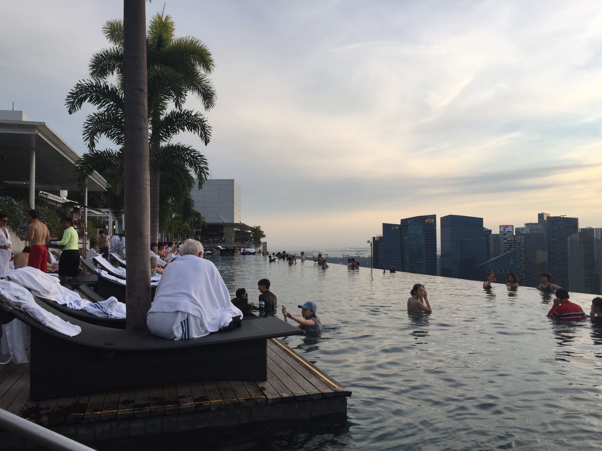

# Singapore

## Images

|Marina Bay Sands|infinity pool|
|--|--|
| ||
|[Wikipedia](https://ja.wikipedia.org/wiki/%E3%83%9E%E3%83%AA%E3%83%BC%E3%83%8A%E3%83%99%E3%82%A4%E3%83%BB%E3%82%B5%E3%83%B3%E3%82%BA)||
|NightActivityies||
||--|

## Description
- I visited Singapore in 2018 summer.
- Hotel
  - The building seemed that it has a ship on the top.
  - It's a landmark hotel in Singapore that has roof-top pool called infinity pool.
  - Marina Bay Sands seems to be physically unstable structure.
  - The building company which built the building became bankrupt becase of its continuity.
- History & culture
  - Singapore got independence about 20 years ago from Malaysia.
- Activities
  - There are a lot of night activities, such as night-show, night-safari, night-cuise, and casino.

## Words & Phrases
- hotel
  - high-end, luxurious
  - regular, affordable
  - low cost

